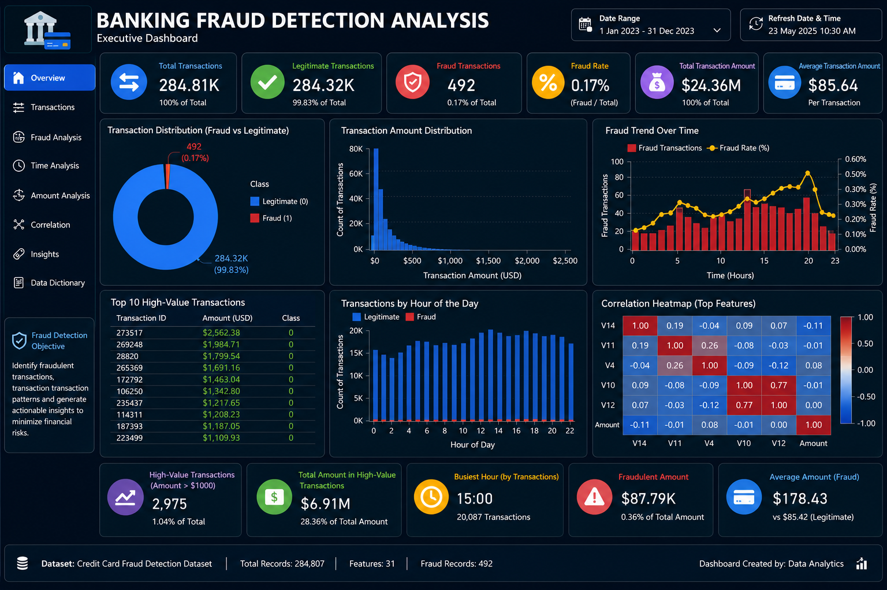

# Banking Fraud Detection Analysis – Major Project

## Project Overview

This project presents an end-to-end data analytics solution for analyzing banking transaction data to identify fraudulent activities, understand transaction patterns, and generate actionable business insights. Using a real-world credit card transaction dataset, the project demonstrates the complete data analytics lifecycle, including data cleaning, exploratory data analysis, statistical analysis, SQL-based querying, feature engineering, data transformation, and dashboard preparation.

The project has been developed as a comprehensive academic major project to demonstrate practical data analytics skills using industry-standard tools and techniques.

---

## Problem Statement

Financial institutions process millions of transactions every day, making it challenging to detect fraudulent activities accurately and efficiently. Fraudulent transactions represent only a small fraction of all transactions, making them difficult to identify using traditional monitoring methods.

The objective of this project is to analyze a real-world credit card transaction dataset, identify fraud patterns, compare fraudulent and legitimate transactions, generate meaningful business insights, and prepare the data for business intelligence dashboards and future predictive analytics.

---

## Dashboard



___


## Project Objectives

* Analyze real-world banking transaction data.
* Clean and preprocess the dataset.
* Perform Exploratory Data Analysis (EDA).
* Create meaningful visualizations.
* Analyze data using SQL queries.
* Apply statistical techniques for data interpretation.
* Perform feature engineering and data transformation.
* Prepare datasets for dashboard development.
* Generate business insights and recommendations.

---

## Dataset Information

**Dataset:** Credit Card Fraud Detection Dataset

### Features

* Time
* Amount
* V1–V28 (Anonymized Features)
* Class

  * 0 – Legitimate Transaction
  * 1 – Fraudulent Transaction

**Note:** The original dataset may not be included in this repository because it can exceed GitHub's file size limit. Download the dataset separately and place `creditcard.csv` in the project folder before running the notebook.

## About the Dataset

This project uses the **Credit Card Fraud Detection Dataset**, a real-world dataset widely used for fraud detection research and data analytics. It contains anonymized credit card transactions made by European cardholders over a two-day period.

The dataset consists of **284,807 transactions** with **31 features**, including transaction time, transaction amount, anonymized numerical features (`V1`–`V28`), and a target variable (`Class`) indicating whether a transaction is legitimate or fraudulent.

### Dataset Features

| Feature | Description                                                                      |
| ------- | -------------------------------------------------------------------------------- |
| Time    | Time elapsed since the first transaction in the dataset                          |
| V1–V28  | Anonymized numerical features generated using Principal Component Analysis (PCA) |
| Amount  | Transaction amount                                                               |
| Class   | Target variable (0 = Legitimate Transaction, 1 = Fraudulent Transaction)         |

### Dataset Summary

* Total Transactions: **284,807**
* Total Features: **31**
* Legitimate Transactions (Class = 0): **284,315**
* Fraudulent Transactions (Class = 1): **492**
* Dataset Type: Highly imbalanced binary classification dataset


---

## Technologies Used

* Python
* NumPy
* Pandas
* Matplotlib
* Seaborn
* SQLite
* Scikit-learn
* Jupyter Notebook / Visual Studio Code
* Power BI
* Git
* GitHub

---

## Project Workflow

1. Problem Understanding
2. Data Collection
3. Dataset Loading
4. Data Cleaning
5. Data Preprocessing
6. Exploratory Data Analysis
7. Data Visualization
8. Advanced Pandas Operations
9. SQL Analysis
10. Advanced SQL Operations
11. Statistical Analysis
12. Feature Engineering
13. Data Transformation
14. Time-Based Analysis
15. Business Insights
16. Dashboard Dataset Preparation
17. Project Conclusion

---

## Key Analyses Performed

### Data Cleaning

* Missing value analysis
* Duplicate detection
* Data validation

### Exploratory Data Analysis

* Dataset overview
* Transaction distribution
* Fraud versus legitimate transaction analysis
* Transaction amount analysis

### Data Visualization

* Histograms
* Box plots
* Count plots
* Pie charts
* Correlation heatmaps
* Time-based visualizations

### Advanced Pandas

* GroupBy operations
* Aggregation
* Pivot tables
* Feature creation
* Ranking and sorting

### SQL Analysis

* SELECT
* WHERE
* ORDER BY
* GROUP BY
* HAVING
* INNER JOIN

### Statistical Analysis

* Mean
* Median
* Mode
* Variance
* Standard deviation
* Quartiles
* Correlation
* Skewness
* Kurtosis

### Feature Engineering

* Hour feature creation
* Log transformation
* Normalization
* Standardization
* High-value transaction flag

---

## Dashboard KPIs

The dashboard includes the following key performance indicators:

* Total Transactions
* Fraud Transactions
* Legitimate Transactions
* Fraud Rate
* Total Transaction Amount
* Average Transaction Amount
* High-Value Transactions
* Hourly Transaction Distribution
* Fraud Trend Analysis
* Correlation Analysis
* Business KPI Summary

---

## Project Structure

```text
Banking-Fraud-Detection-Analysis-Major-Project/
│
├── Banking_Fraud_Detection_Analysis_Major_Project.ipynb
├── creditcard.csv
├── cleaned_creditcard.csv
├── final_creditcard_dataset.csv
├── Banking_Fraud_Detection_Analysis_Dashboard.png
└── README.md
```

---

## How to Run the Project

1. Clone the repository.
2. Download the Credit Card Fraud Detection dataset.
3. Place `creditcard.csv` in the project folder.
4. Open the notebook using Visual Studio Code or Jupyter Notebook.
5. Install the required Python libraries.
6. Run all notebook cells sequentially.
7. Review the outputs and visualizations.
8. Use the exported dataset for Power BI dashboard development.

---

## Key Business Insights

* Fraudulent transactions represent only a very small percentage of the dataset.
* The dataset is highly imbalanced, requiring careful analysis.
* Most transactions involve relatively small amounts, while a limited number of high-value transactions contribute significantly to the overall transaction volume.
* Feature engineering improves analytical capabilities and supports future predictive modeling.
* SQL enables efficient business reporting and transaction summarization.
* Time-based analysis provides additional insights into transaction behavior.

---

## Recommendations

* Implement continuous fraud monitoring systems.
* Apply additional verification for high-value transactions.
* Combine statistical analysis with machine learning techniques for improved fraud detection.
* Develop interactive dashboards for operational monitoring.
* Regularly update fraud detection models using newly collected transaction data.

---

## Dashboard Preview

The project includes a professional dashboard presenting:

* Executive KPI Summary
* Fraud Rate Overview
* Transaction Distribution
* Hourly Transaction Analysis
* Fraud Trend Analysis
* Correlation Insights
* Business Recommendations

---

## Future Enhancements

* Machine Learning–based fraud prediction
* Real-time fraud monitoring
* Interactive Power BI dashboard
* Model performance evaluation
* Automated fraud alert system
* Cloud deployment

---

## Conclusion

This project demonstrates a complete data analytics workflow using a real-world banking transaction dataset. By integrating Python, SQL, statistics, data visualization, and feature engineering, it provides meaningful insights into fraudulent transaction patterns and establishes a strong foundation for future predictive analytics and business intelligence solutions.
